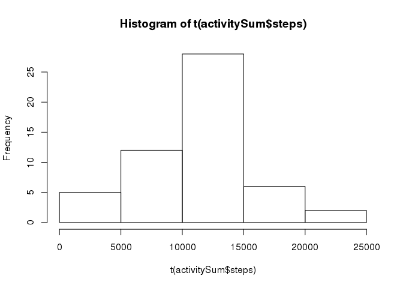
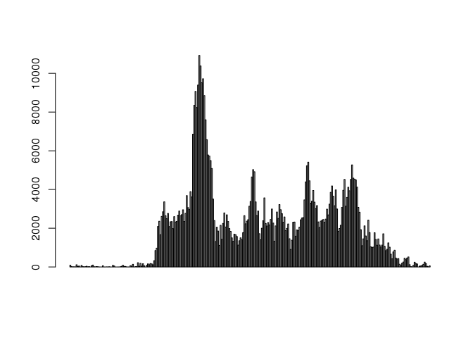
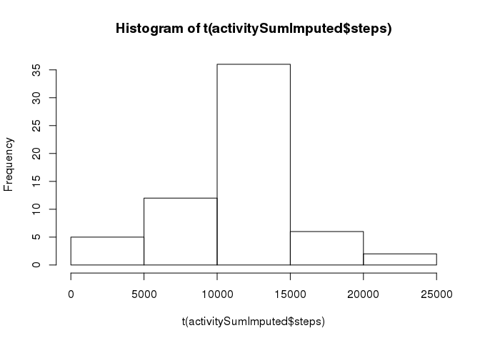
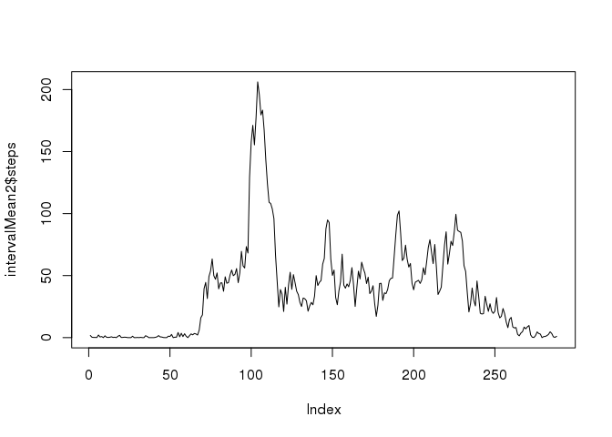
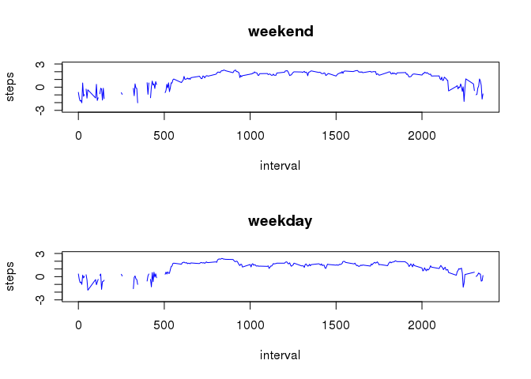

# Reproducible Research: Course Project 1


## Loading and preprocessing the data

Activity data for this assignment is pulled from:
[Coursera Activity Data](https://d396qusza40orc.cloudfront.net/repdata%2Fdata%2Factivity.zip).


```r
library(dplyr)
```

```
## 
## Attaching package: 'dplyr'
```

```
## The following objects are masked from 'package:stats':
## 
##     filter, lag
```

```
## The following objects are masked from 'package:base':
## 
##     intersect, setdiff, setequal, union
```

```r
activityData <- read.csv("activity.csv")
activitySummary <- summary(activityData)

activityData$date <- as.Date(activityData$date)
missing <- is.na(activityData$steps)
```


## What is mean total number of steps taken per day?

1. Calculate the total number of steps taken per day:


```r
activitySum    <- aggregate(activityData$steps ~ activityData$date, FUN=sum)
activityMean   <- aggregate(activityData$steps ~ activityData$date, FUN=mean)
activityMedian <- aggregate(activityData$steps ~ activityData$date, FUN=median)

sumStepsPerDay <- sum(activityData$steps[!missing])
meanStepsPerDay <- mean(activityData$steps[!missing])

names(activitySum)    <- c("date", "steps")
names(activityMean)   <- c("date", "steps")
names(activityMedian) <- c("date", "steps")
```

The mean total number of steps taken per day was 37.4.


2. Make a histogram of the total number of steps taken each day:


```r
# activityMean <- aggregate(activityData$steps~activityData$date, FUN=mean) 
# names(activityMean) <- c("Date", "Steps")

hist(t(activitySum$steps))
```



3. Calculate and report the mean and median of the total number of steps taken per day.


```r
#plot(activityData$steps ~ activityData$date, col=rgb(0,0,0,alpha=0.3), ylab="Steps", xlab="Date")
activityMean   <- aggregate(activityData$steps ~ activityData$date, FUN=mean)
activityMedian <- aggregate(activityData$steps ~ activityData$date, FUN=median)

#barplot(activityMean$Steps)
```

The mean of the total number of steps taken per day is 37.
The median of the total number of steps taken per day is 10765.


## What is the average daily activity pattern?

### Make a time series plot (i.e. type = "l") of the 5-minute interval (x-axis) and the average number of steps taken, averaged across all days (y-axis)

```r
activityInterval <- aggregate(activityData$steps ~ activityData$interval, FUN=sum)
activityIntervalMean <- aggregate(activityData$steps ~ activityData$interval, FUN=mean)

names(activityInterval) <- c("interval", "steps")
names(activityIntervalMean) <- c("interval", "steps")

# These plots should be similar except for scale. sum() vs mean() 
barplot(activityInterval$steps)
```



```r
barplot(activityIntervalMean$steps)
```


```r
kllstart <- activityInterval$interval[1]
kllend <- activityInterval$interval[nrow(activityInterval)]

# Find the maximum value (returns an index)
intervalMax <- which.max(activityInterval$steps)
# Dereference the index to get the time value
intervalMaxTime <- activityInterval$interval[intervalMax]

tempTime <- paste("0000", intervalMaxTime, "00", sep="" )
tempMins <- substr(tempTime, nchar(tempTime) - 3, nchar(tempTime) - 2)
tempHour <- substr(tempTime, nchar(tempTime) - 5, nchar(tempTime) - 4)
#tempMins
#tempHour
prettyTime <- sprintf("%s:%s", tempHour, tempMins)
if (as.numeric(tempHour) > 12) meridian="PM" else 
  meridian="AM"
```

### Which 5-minute interval, on average across all the days in the dataset, contains the maximum number of steps?

At 08:35 AM  was the highest value.

## Imputing missing values

### Calculate and report the total number of missing values in the dataset (i.e. the total number of rows with NAs)


```r
missingSteps <- is.na(activityData$steps)
```

In the dataset, 2304 rows had missing data (NA).

### Devise a strategy for filling in all of the missing values in the dataset. The strategy does not need to be sophisticated. For example, you could use the mean/median for that day, or the mean for that 5-minute interval, etc.

###Calculate and report the total number of missing values in the dataset (i.e. the total number of rows with NAs)

###Devise a strategy for filling in all of the missing values in the dataset. The strategy does not need to be sophisticated. For example, you could use the mean/median for that day, or the mean for that 5-minute interval, etc.

###Create a new dataset that is equal to the original dataset but with the missing data filled in.

###Make a histogram of the total number of steps taken each day and Calculate and report the mean and median total number of steps taken per day. Do these values differ from the estimates from the first part of the assignment? What is the impact of imputing missing data on the estimates of the total daily number of steps?


```r
# The imputed value can depend on a few things:
# activityData[missingSteps,]$steps = [SOME COMPUTED VALUE]
# Using the mean of that day is simple enough

# intervalMean is the mean of that interval across all days
intervalMean <- aggregate(activityData$steps ~ activityData$interval, FUN=mean)
names(intervalMean) <- c("interval", "steps")

missing <- is.na(activityData$steps)
activityDataImputed <- activityData
activityDataImputed[missingSteps,]$steps <- intervalMean$steps
 
activitySumImputed    <- aggregate(activityDataImputed$steps ~ activityData$date, FUN=sum)
activityMeanImputed   <- aggregate(activityDataImputed$steps ~ activityData$date, FUN=mean)
activityMedianImputed <- aggregate(activityDataImputed$steps ~ activityData$date, FUN=median)

sumStepsPerDayImputed <- sum(activityDataImputed$steps)
meanStepsPerDayImputed <- mean(activityDataImputed$steps)

names(activitySumImputed)    <- c("date", "steps")
names(activityMeanImputed)   <- c("date", "steps")
names(activityMedianImputed) <- c("date", "steps")

hist(t(activitySumImputed$steps))
```


The mean of the total number of steps taken per day (imputed) is 37.
The median of the total number of steps taken per day (imputed) is 1.0766189\times 10^{4}.


## Are there differences in activity patterns between weekdays and weekends?


```r
activityDataImputed <- mutate(activityDataImputed, dayOfWeek=weekdays(activityDataImputed$date))

#activityWeekend <- subset(activityDataImputed, dayOfWeek %in% c("Saturday", "Sunday"))
#activityWeekday <- subset(activityDataImputed, dayOfWeek %in% c("Monday", "Tuesday", "Wednesday", "Thursday", "Friday"))

activityDataImputed <- mutate(activityDataImputed, dayType="weekday")
weekend <- activityDataImputed$dayOfWeek %in% c("Saturday", "Sunday")
activityDataImputed[weekend,]$dayType = "weekend"

intervalMean2 <- aggregate(activityDataImputed$steps ~ activityDataImputed$interval, FUN=mean)
names(intervalMean2) <- c("interval", "steps")

plot(intervalMean2$steps, type="l")
```



```r
activityWeekend <- subset(activityDataImputed, dayType=="weekend")
activityWeekday <- subset(activityDataImputed, dayType=="weekday")

par(mfrow=c(2,1), ylab="number of steps")
```

```
## Warning in par(mfrow = c(2, 1), ylab = "number of steps"): "ylab" is not a
## graphical parameter
```

```r
intervalMean3 <- aggregate(activityWeekend$steps ~ activityWeekend$interval, FUN=mean)
intervalMean4 <- aggregate(activityWeekday$steps ~ activityWeekday$interval, FUN=mean)

names(intervalMean3)<-c("interval","steps")
names(intervalMean4)<-c("interval","steps")

intervalMean3$steps <- sapply(intervalMean3$steps, log10)
intervalMean4$steps <- sapply(intervalMean4$steps, log10)

plot(intervalMean3$steps ~ intervalMean3$interval, 
     type="l", 
     main="weekend", 
     xlab="interval", 
     ylab="steps", 
     ylim=c(-3,3),
     col="blue")

plot(intervalMean4$steps ~ intervalMean4$interval, type="l", main="weekday", xlab="interval", ylab="steps", ylim=c(-3,3), col="blue")
```


